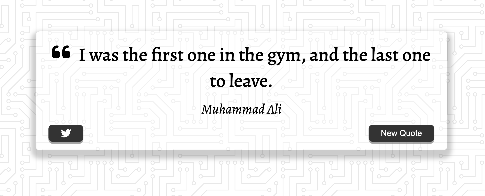

# Quote Generator

The idea or inspiration comes from the ZTM Cours on Udemy  ([JavaScript Web Projects: 20 Projects to Build Your Portfolio](https://www.udemy.com/course/javascript-web-projects-to-build-your-portfolio-resume)). Plus, I wanted to try module `gh-pages` as a deployment with vite and react. Original project is coded in `vanilla js` ([Quote Generator](https://github.com/buzzcosm/quote-generator-vanilla-js-app)).



## Development

### Install

```bash
npm install
```

### Run

```bash
npm run dev
```

### Clean

*Delete `dist` and `node_modules` folders.*

> [!TIP]
> Keep your things clean!

```bash
npm run clean
```

## Deployment

> [!IMPORTANT]  
> Setup for GitHub Pages for deployment:  
> *Extended `vite.config.js` with `base`*  
> Info [here](https://vitejs.dev/config/)
>
>```js
>export default defineConfig({
>  base: "/quote-generator-react-js-gh-pages",
>  ...
>})
>```


```bash
npm run deploy
```

## Useful references

- [DEV - Deploying Vite / React App to GitHub Pages](https://dev.to/rashidshamloo/deploying-vite-react-app-to-github-pages-35hf)
- [Medium - Loader](https://medium.com/@cabhishek712/implementing-a-loader-loading-spinner-in-react-function-components-950eef0f4253)
- [fontawesome](https://fontawesome.com/)
- [DEV - Font Awesome in React](https://dev.to/davidemaye/how-to-set-up-font-awesome-in-react-5a8d)
- [GitHub Community - An option to highlight a "Note" and "Warning" using blockquote](https://github.com/orgs/community/discussions/16925)
- [How to Create a Custom useFetch Hook in React](https://dev.to/adetutu/how-to-create-a-custom-usefetch-hook-in-react-4p7)